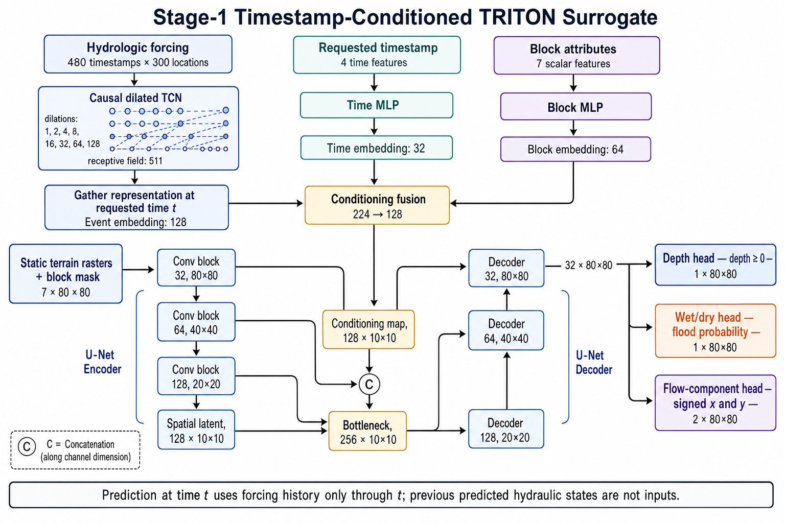

# Triton Lite Block-wise Surrogate

## Dynamic Stage-1 pipeline

The Stage 1 model is a timestamp-conditioned surrogate. It streams full TRITON
trajectories from netCDF and predicts one block-local hydraulic state at a
requested event timestamp:

```text
hydrologic forcing through time t
+ requested timestamp t
+ scalar block attributes
+ static 10 m terrain rasters and block mask
    -> depth(t), wet probability(t), component_x(t), component_y(t)
```



Start with [`PROJECT_GUIDE.md`](PROJECT_GUIDE.md). The complete data/model
contract is documented in
[`docs/stage1/STAGE1_TIMESTAMP_SURROGATE.md`](docs/stage1/STAGE1_TIMESTAMP_SURROGATE.md).
The older workflow remains available as an event-peak baseline.

### Stage 1 inputs

Each sample represents one `(event_id, timestamp, block_id)` combination.

| Input | Default shape | Purpose |
|---|---:|---|
| Hydrologic event | `480 x 300` | Ten days of forcing at 30-minute intervals for 300 source locations |
| Requested time index | scalar | Selects the hydraulic state to predict |
| Time features | `4` | Event fraction, sine/cosine position, and normalized elapsed hours |
| Block attributes | `7` | Location and summary terrain/hydrologic properties |
| Static terrain | `6 x 80 x 80` | DEM, flow accumulation, stream mask, distance to stream, slope, and relative elevation |
| Block mask | `80 x 80` | Identifies valid cells and excludes padding |

The complete event tensor is loaded for efficient batching, but the temporal
network is causal: a prediction at time `t` cannot use forcing values after
`t`. Event, block, and static-feature normalization statistics are computed
from training events only.

### Temporal and conditioning encoders

The hydrologic forcing passes through an eight-layer temporal convolutional
network (TCN). Kernel size 3 and dilations `1, 2, 4, ..., 128` give a 511-step
receptive field, which covers the full 480-step event. Each block contains a
causal convolution, per-timestamp LayerNorm, GELU activation, dropout, and a
residual connection. LayerNorm is used instead of temporal BatchNorm to avoid
leaking future timestamps through training-time statistics.

The TCN representation at the requested timestamp is gathered as a
128-dimensional event embedding. In parallel:

- a small MLP converts the four time features to a 32-dimensional embedding;
- a block MLP converts the scalar block attributes to a 64-dimensional embedding.

These three vectors are concatenated (`128 + 32 + 64 = 224`) and projected to
a 128-dimensional conditioning vector.

### Conditioned spatial U-Net

The six static rasters and block mask enter a three-level U-Net. With the
default base width of 32 channels, the encoder produces feature maps at:

```text
32 x 80 x 80 -> 64 x 40 x 40 -> 128 x 20 x 20 -> 128 x 10 x 10
```

The 128-dimensional event/time/block conditioning vector is repeated across
the `10 x 10` spatial grid and concatenated with the spatial latent map. The
bottleneck and decoder then reconstruct an `80 x 80` representation using
bilinear upsampling and U-Net skip connections. This design lets the event
forcing control the hydraulic response while the terrain encoder determines
where water can accumulate and move inside the block.

### Outputs

The shared decoder feeds three heads:

- **Depth:** one nonnegative `80 x 80` map; `Softplus` enforces depth `>= 0`.
- **Wet/dry:** one `80 x 80` logit map; sigmoid gives flood probability.
- **Signed components:** two `80 x 80` maps for the x and y flow components.

The component outputs are intentionally not called velocity in the model. An
audit of the archived simulation source confirmed that native U/V are the
conserved HU/HV fields (unit discharge in `m²/s`). Legacy netCDF variable names
and attributes call them velocity, but the numerical arrays are unchanged. See
`docs/stage1/TRITON_COMPONENT_SEMANTICS_AUDIT.md`.

### Training objective

The default loss combines five terms:

```text
L = wet-cell depth Huber
  + 0.05 * dry-cell depth penalty
  + 0.20 * wet/dry BCE
  + 0.50 * wet-cell component Huber
  + 0.05 * dry-cell component penalty
```

Cells with target depth at least `0.05 m` are considered wet by default. The
dry-cell terms discourage artificial shallow flooding and nonzero flow in dry
areas. Training batches share an event and timestamp and contain spatially
nearby blocks, allowing the netCDF chunk cache to reuse data efficiently.

### Scope of Stage 1

Stage 1 predicts each requested timestamp independently. Earlier predicted
depth or flow maps are **not** fed into later predictions, so prediction error
does not recursively accumulate through all 480 steps. This makes Stage 1 a
timestamp emulator rather than an autoregressive simulator; recurrent state
propagation and cross-block hydraulic exchange belong to the planned Stage 2
model.

This repository contains two block-wise Triton Lite surrogate workflows:

- the timestamp-conditioned Stage 1 model, which predicts depth and signed
  flow-component fields at a requested time;
- the event-peak baseline, which predicts one peak-depth field per event.

Legacy event-peak training, tuning, and prediction scripts are isolated under
`workflows/blockwise/` and retained for reproducibility.

## Repository layout

```text
├── data_preprocessing/
│   ├── m0_generate_netcdf_from_zip.py
│   ├── m1a_build_event_sources.py
│   ├── m1b_event_to_tensor.py
│   ├── m2_block_feature_extraction.py
│   ├── m2_5_prepare_block_static_rasters.py
│   ├── m3_prepare_10m_label_assets.py
│   ├── m3_build_dynamic_manifest.py
│   ├── m4_build_stage1_sampling_index.py
│   ├── m4_merge_stage1_sampling_index.py
│   ├── README_m1_events.md
│   ├── README_m2_blocks.md
│   ├── README_m3_labels_from_netcdf.md
│   └── README_m4_sampling_index.md
├── workflows/
│   ├── stage1/                              # active ordered Slurm jobs
│   ├── blockwise/                           # legacy event-peak jobs
│   └── uncertainty/                         # optional ensemble job
├── docs/
│   ├── stage1/                              # active architecture/experiment docs
│   ├── project/                             # historical decisions and plans
│   └── images/
├── plot/                                    # plotting utilities
├── tests/                                   # unit and smoke tests
├── stage1_*.py                              # active Stage-1 modules and entry points
├── blockwise_*.py                           # shared and legacy baseline modules
├── PROJECT_GUIDE.md                         # workflow/navigation starting point
└── README.md
```

## Event-peak baseline training target

The older baseline uses one `(event_id, watershed_id, block_id)` row with an
event-level spatial target:

- `X_event`: event time series from Milestone 1, stored as `X_event.npy` with shape `T x F`
- `X_block`: static block features from Milestone 2
- `Y_10m`: an 80x80 peak-depth patch plus a matching block mask from Milestone 3

The model architecture matches the current design direction:

- temporal encoder over the hydrologic event time series
- block encoder over static block metadata
- late fusion
- spatial decoder to an 80x80 depth field for one block

## Requirements

The active code path requires:

- Python with `numpy`, `pandas`, `scikit-learn`, and `torch`
- `pyarrow` or `fastparquet` for parquet I/O
- geospatial dependencies for preprocessing scripts, including `geopandas`, `rasterio`, and `shapely`

Example install:

```bash
pip install numpy pandas scikit-learn torch pyarrow geopandas rasterio shapely
```

## Data Processing

The supported preprocessing flow is under [data_preprocessing](/lustre/orion/proj-shared/cli138/7hn/triton/Triton_Lite_Ornl/data_preprocessing).

### Milestone 1: Event Tensors

Use:

- `m1a_build_event_sources.py`
- `m1b_event_to_tensor.py`

Outputs:

- `events.csv`
- `events/<watershed_id>/<event_id>/X_event.npy`

Reference docs:

- [README_m1_events.md](/lustre/orion/proj-shared/cli138/7hn/triton/Triton_Lite_Ornl/data_preprocessing/README_m1_events.md)

### Milestone 2: Block Features

Use:

- `m2_block_feature_extraction.py`

Output:

- `blocks.parquet`

Reference docs:

- [README_m2_blocks.md](/lustre/orion/proj-shared/cli138/7hn/triton/Triton_Lite_Ornl/data_preprocessing/README_m2_blocks.md)

### Milestone 3: 10m Label Assets

Use:

- `m0_generate_netcdf_from_zip.py`
- `m3_prepare_10m_label_assets.py`

Output:

- `events_peak_10m/*.npy`
- `block_index_10m.npy`
- `block_index_lookup.parquet`
- `labels_10m_manifest.parquet`
- `labels_10m_metadata.json`

Reference docs:

- [README_m3_labels_from_netcdf.md](/lustre/orion/proj-shared/cli138/7hn/triton/Triton_Lite_Ornl/data_preprocessing/README_m3_labels_from_netcdf.md)

## Training

Train the current model with [train_blockwise_matrix.py](/lustre/orion/proj-shared/cli138/7hn/triton/Triton_Lite_Ornl/train_blockwise_matrix.py):

```bash
/ccs/home/haoranniu/miniconda3/envs/triton/bin/python train_blockwise_matrix.py \
  --events-csv processed_data/blockwise_global/milestone_01_events/events.csv \
  --blocks-parquet processed_data/blockwise_global/milestone_02_blocks/blocks.parquet \
  --labels-10m-dir processed_data/blockwise_global/milestone_03_labels_10m \
  --output-dir results_blockwise_matrix \
  --test-events D040
```

Important behavior:

- splitting is done by event, not by individual event-block rows
- normalization is fit on the training split only
- outputs include a model checkpoint, split tables, normalization stats, and masked metrics

### Training Outputs

The training output directory contains:

- `best_model.pt`
- `metrics.json`
- `run_config.json`
- `normalization_stats.npz`
- `splits/train_samples.csv`
- `splits/val_samples.csv`
- `splits/test_samples.csv`

Current implementation scope:

- matrix training
- matrix hyperparameter tuning
- matrix inference and evaluation

## Tuning

Tune the matrix model with [tune_blockwise_matrix.py](/lustre/orion/proj-shared/cli138/7hn/triton/Triton_Lite_Ornl/tune_blockwise_matrix.py):

```bash
/ccs/home/haoranniu/miniconda3/envs/triton/bin/python tune_blockwise_matrix.py \
  --events-csv processed_data/blockwise_global/milestone_01_events/events.csv \
  --blocks-parquet processed_data/blockwise_global/milestone_02_blocks/blocks.parquet \
  --labels-10m-dir processed_data/blockwise_global/milestone_03_labels_10m \
  --output-dir results_blockwise_matrix_tuning \
  --test-events D040
```

Tuning outputs:

- `best_config.json`
- `trials.json`
- `summary.json`

The saved `best_config.json` can be passed directly to `train_blockwise_matrix.py` with `--config-json`.

## Inference

Run matrix inference with [predict_blockwise_matrix.py](/lustre/orion/proj-shared/cli138/7hn/triton/Triton_Lite_Ornl/predict_blockwise_matrix.py):

```bash
/ccs/home/haoranniu/miniconda3/envs/triton/bin/python predict_blockwise_matrix.py \
  --events-csv processed_data/blockwise_global/milestone_01_events/events.csv \
  --blocks-parquet processed_data/blockwise_global/milestone_02_blocks/blocks.parquet \
  --labels-10m-dir processed_data/blockwise_global/milestone_03_labels_10m \
  --checkpoint results_blockwise_matrix_train/best_model.pt \
  --normalization-stats results_blockwise_matrix_train/normalization_stats.npz \
  --output-dir results_blockwise_matrix_predictions \
  --event-ids D040 \
  --evaluate
```

Inference outputs:

- `predictions.npy` with shape `(N, 80, 80)` written as a memmapped `.npy`
- `prediction_manifest.parquet` with `sample_index`, `event_id`, `watershed_id`, `block_id`, and `block_index`
- `summary.json`
- optional `metrics.json` when `--evaluate` is supplied

## Status

Supported now:

- block-wise preprocessing through Milestones 1, 2, and 3
- block-wise 10m matrix training with `train_blockwise_matrix.py`
- block-wise 10m matrix tuning with `tune_blockwise_matrix.py`
- block-wise 10m matrix inference with `predict_blockwise_matrix.py`

The repository now keeps only the active block-wise preprocessing path.
